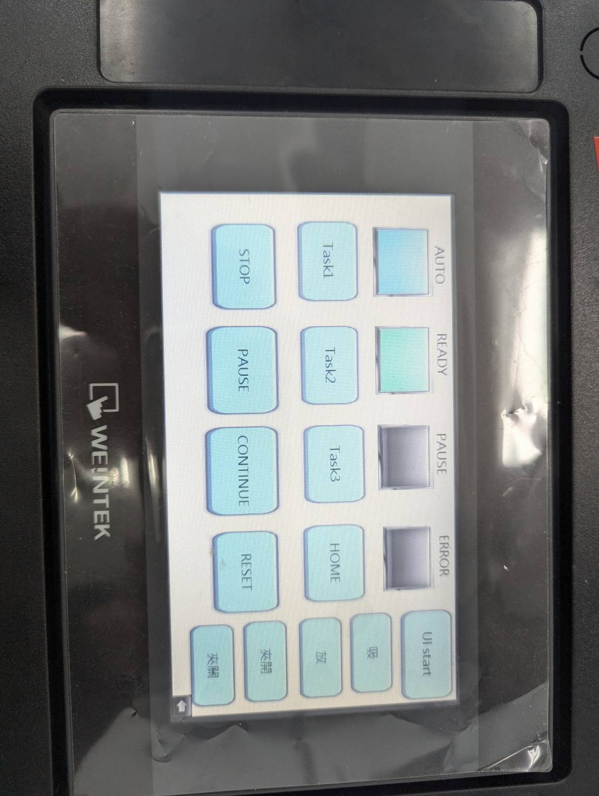

# 組別: B3

## 組員
- 吳弘昌:task1、task2、task3、AMR  
- 吳柏城:task1、task2、task3、AMR
- 李東陽:task1、task2、task3、HMI

## 專案內容

### **Task 0: Simulation Layout**
**簡介**  
- 包含 Task 1 和 Task 2 程式碼的模擬結果。  
- 使用 Epson RC+ 完成模擬與錄製相關影片。

---

### **Task 1: Pick and Place Code**
**簡介**  
- 程式碼位於 `1209` 資料夾中的 `Main.prg` (Function `main`)。  
- 功能：執行取放動作 ，將3個token和3個block放置在tray place指定位置上。

---

### **Task 2: Stacking Code**
**簡介**  
- 程式碼位於 `1209` 資料夾中的 `Main1.prg` (Function `main1`)。  
- 功能：執行堆疊操作，將10個token和10個block相互堆疊起來。

---

### **Task 3: HMI Control & 雙金字塔堆疊**
**簡介**  
1. **HMI 設定**  
   - 位於 `HMI` 資料夾，包括 HMI 控制器的設定。  
   - 功能：控制手臂移動、開始、停止、中斷、繼續、吸嘴和夾具，以及觸發Task 1、Task 2、Task 3功能運行
2. **雙金字塔堆疊程式**  
   - 程式碼位於 `1209` 資料夾中的 `Main2.prg` (Function `main2`)。
   - 功能：透過夾具夾取stacking完成的工建塔，分類堆疊成兩座金字塔(token&block)。

**範例**  

